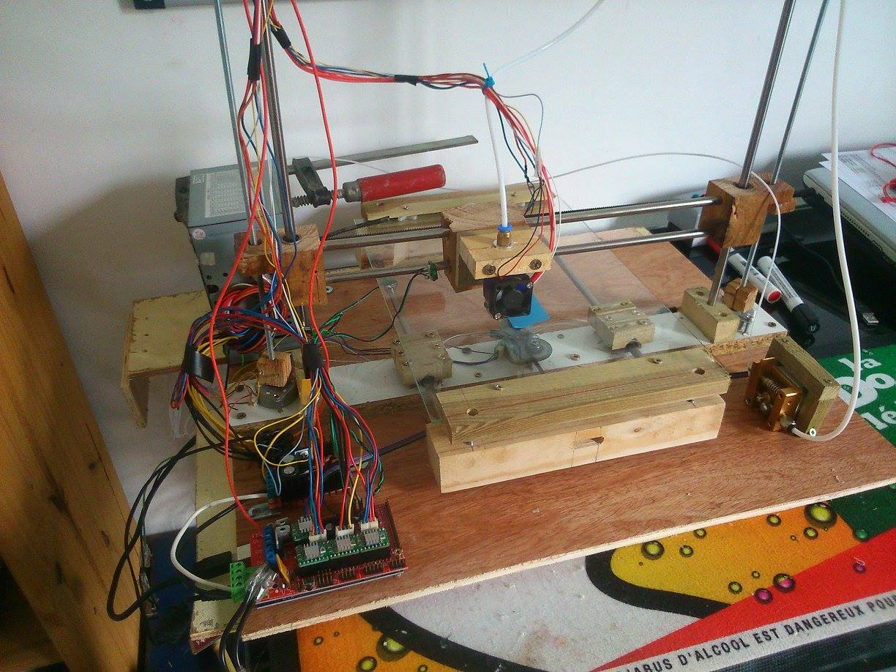
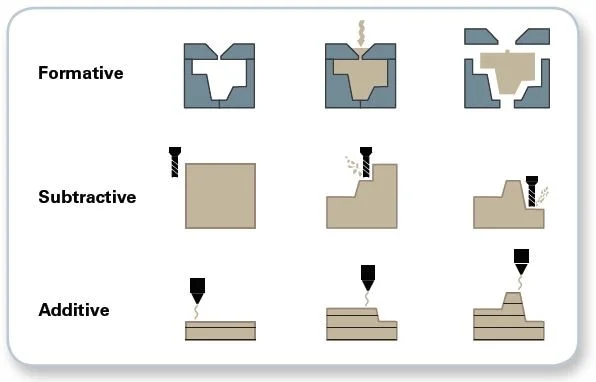
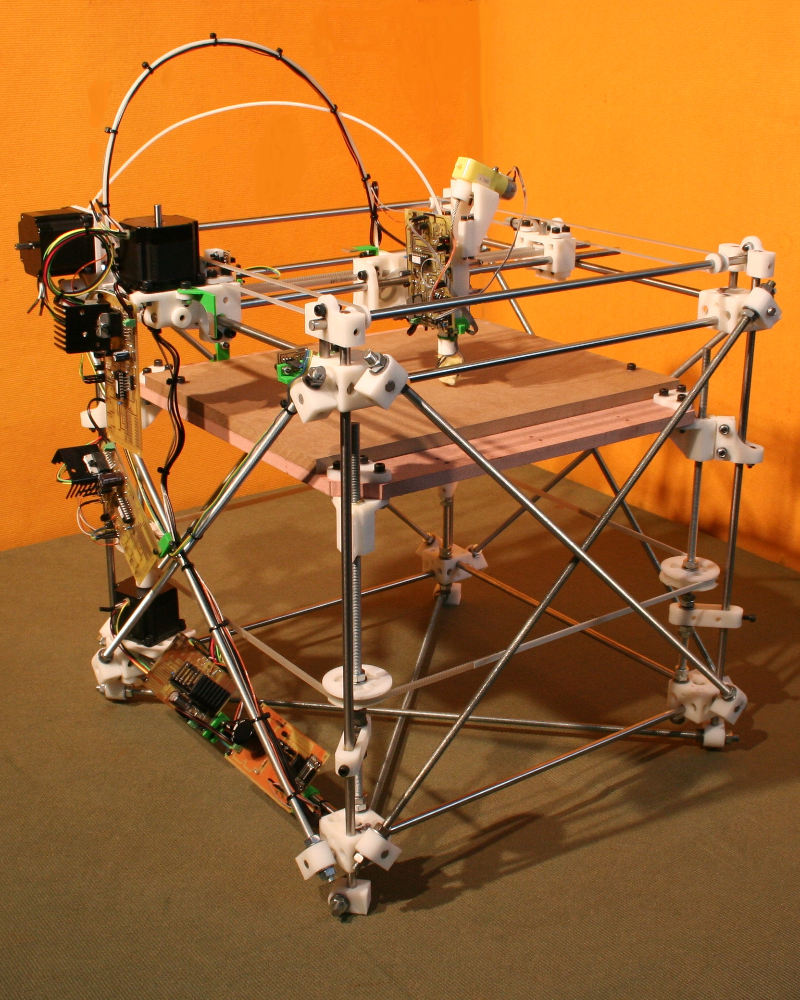
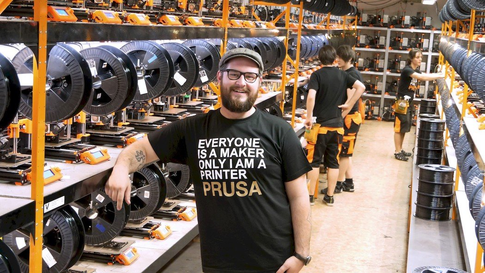
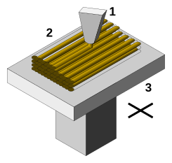
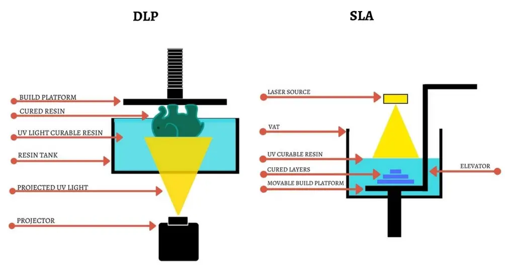

<!-- _class: title -->

# ***CAO pour l'impression 3D***
## Introduction à l'impression 3D
Kévin Hoarau - Septembre 2023

---

# La fabrication additive

* L'impression 3D est une méthode de **fabrication additive**
* Elle s'oppose aux méthodes de fabrication soustractive ou de moulage, très largement employé dans l'industrie.
* Permet un prototypage rapide et à faible coût

  

"How Can 3D Optical Profiling Optimize Additive Manufacturing Processes?", Azom.com

---

# Histoire de l'impression 3D grand public

<!--* 1988 : Brevetage de la technologie SLS (*Selective Laser Sintering*)-->
* 1988 : Brevetage de la technologie FDM (*Fused Deposition Modeling*)
* 2005 : Le projet RepRap est lancée par Adrian Bowyer (Université de Bath, Royaume-Uni)
* 2008 : La "Darwin" produit une réplication complète d'elle-même (pièces imprimables)
* 2009 : Le brevet sur la technologie FDM expire

  

RepRap 1.0 "Darwin"

---

# Histoire de l'impression 3D grand public

* 2009 : Josef Prusa simplifie la RepRap Mendel et crée la Prusa Mendel
"Le modèle Prusa est la Ford T des imprimantes 3D."(Reprap.org)
* 2015 : Commercialisation de la Prusa i3
* 2016 : K. Hoarau construit une imprimante 3D approximative avec des chutes de bois
* 2018 : Commercialisation de la Creality Ender 3 à moins de 200€

  

Ferme d'impression Prusa

---

# Technologies d'impression 3D

## Fused deposition modeling (FDM)

* La technologie FDM ou DFF (dépôt de fil fondu) est la plus répandu 
* Elle consiste à faire fondre un filament de matière polymères puis a déposé cette matière couche par couche

  

"Procédé Fused Deposition Modeling (FDM)", Wikipedia

---

# Technologies d'impression 3D

## La photopolymérisation

*  Les imprimantes SLA (*StereoLithography Apparatus*) utilisent un balayage laser pour solidifier une résine sensible aux UV
* Les imprimantes DLP (*Digital Light Processing*) utilisent un projecteur permettant de solidifier une couche entière 

  

"The Difference between DLP and SLA 3D Printing Technology",  MANUFACTUR3D

---

# Les matériaux

---

# Anatomie d'une imprimante FDM

Axes
Moteur pas à pas
Extruder : Direct drive vs Bowden
Hotend : corp de chauffe, buse
Plateau chauffant
Bed leveling : manuel ou assisté
Impression multi-materiaux/multi-color

---

# Delta vs core xy etc

---

# Chaine de production

CAO
Slicer
Impression

---

# Les outils de base

- Pied à coulisse
- Spatule
- Pince à epiler
- Pince coupante

--- 

# CAM

gcode