<!-- _class: title -->

# ***CAO pour l'impression 3D***
## Introduction à l'impression 3D
Kévin Hoarau - Septembre 2023

---

<!-- header: CAO pour l'impression 3D -->

# La fabrication additive

* L'impression 3D est une méthode de **fabrication additive**
* Elle s'oppose aux méthodes de fabrication soustractive ou de moulage, très largement employé dans l'industrie.
* Permet un prototypage rapide et à faible coût

  

"How Can 3D Optical Profiling Optimize Additive Manufacturing Processes?", Azom.com

---

# Histoire de l'impression 3D grand public

<!--* 1988 : Brevetage de la technologie SLS (*Selective Laser Sintering*)-->
* 1988 : Brevetage de la technologie FDM (*Fused Deposition Modeling*)
* 2005 : Le projet RepRap est lancé par Adrian Bowyer (Université de Bath, Royaume-Uni)
* 2008 : La "Darwin" produit une réplication complète d'elle-même (pièces imprimables)
* 2009 : Le brevet sur la technologie FDM expire

  

RepRap 1.0 "Darwin"

---

# Histoire de l'impression 3D grand public

* 2009 : Josef Prusa simplifie la RepRap Mendel et crée la Prusa Mendel
"Le modèle Prusa est la Ford T des imprimantes 3D."(Reprap.org)
* 2015 : Commercialisation de la Prusa i3
* 2016 : K. Hoarau construit une imprimante 3D approximative avec des chutes de bois
* 2018 : Commercialisation de la Creality Ender 3 à moins de 200€

  

Ferme d'impression Prusa

---

# Technologies d'impression 3D

## Fused deposition modeling (FDM)

* La technologie FDM ou DFF (dépôt de fil fondu) est la plus répandue. 
* Elle consiste à faire fondre un filament de matière polymère puis à déposer cette matière couche par couche.

  

"Procédé Fused Deposition Modeling (FDM)", Wikipedia

---

# Technologies d'impression 3D

## La photopolymérisation

*  Les imprimantes SLA (*StereoLithography Apparatus*) utilisent un balayage laser pour solidifier une résine sensible aux UV
* Les imprimantes DLP (*Digital Light Processing*) utilisent un projecteur permettant de solidifier une couche entière 

  

"The Difference between DLP and SLA 3D Printing Technology",  MANUFACTUR3D

---

# Anatomie d'une imprimante FDM

## Châssis (*Frame*)

* La structure la plus répandue est l'imprimante cartésienne
* Le châssis est généralement formé à partir d'extrusions métalliques
* Les axes X et Y sont actionné par un système de courroies (meilleure vitesse et accélération)
* L'axe des Z est actionné par une vis sans fin (meilleur couple)

  

<!--
"The Difference between DLP and SLA 3D Printing Technology",  MANUFACTUR3D
-->

---

# Anatomie d'une imprimante FDM

## Moteur pas à pas (*stepper motor*)

* Les moteurs pas à pas (Nema 17), sont utilisés pour déplacer les différents axes (et l'extrudeur)
* Ce type de moteur permet de contrôler précisément leurs vitesses et positions 
* Pour cela, seul un capteur de fin de course est nécessaire sur chaque axe pour initialiser la position $X=0;Y=0;Z=0$ (*home position*)

  

 

Exemple de moteur NEMA 17  200 pas/révolutions

---

# Anatomie d'une imprimante FDM

## La tête d'impression (*hotend*)

* C'est la pièce centrale qui est chargée de faire fondre le filament
* En fonction de la buse installée, le diamètre de sortie du fil fondu varie (généralement 0.4mm)
* C'est le bloc de chauffe, équipé d'une cartouche de chauffe et d'une thermistance qui permet de controller la température de la buse

  

http://wikifab.hatlab.fr

---

# Anatomie d'une imprimante FDM

## Extrudeur (*extruder*)

* L'extrudeur à pour rôle de pousser le filament vers la tête d'impression
* Une roue dentée montée sur un moteur pas à pas permet d'agripper le filament et de contrôler la vitesse d'extrusion
* Un extrudeur est dit *direct drive* lorsque qu'il est monté très proche de la tête d'impression

  

Extrudeur direct drive

---

# Anatomie d'une imprimante FDM

## Extrudeur Bowden

* Ce type d'extrudeur très répandu dans les imprimantes d'entrée de gamme
* Le moteur de l'extrudeur y est déporté sur le chassis et un tube PTFE guide le filament jusqu'à la tête d'impression
* Il permet de réduire la masse en mouvement
* Cependant, il est peu adapté aux filaments flexibles

  

Extrudeur Bowden

---

# Anatomie d'une imprimante FDM

## Plateau chauffant (Heated Bed)

* Le plateau est la surface sur laquelle la pièce va être imprimée
* La partie chauffante permet de contrôler la température du plateau afin d'éviter le décollement de la pièce durant l'impression
* Un support est généralement utilisé, son rôle est notamment d'améliorer d'adhérence durant l'impression et de faciliter le retrait de la pièce post-impression.

  

<!--
"The Difference between DLP and SLA 3D Printing Technology",  MANUFACTUR3D
-->

---

# Anatomie d'une imprimante FDM

## Carte mère (*controller board*)

* Elle est chargée de piloter l'ensemble des composants de l'imprimante
* Elle interprète les instructions envoyées par un ordinateur ou contenu dans un fichier
* Parfois il est possible de changer les contrôleurs des moteurs pas à pas

  

Ramps 1.4 (Reprap Arduino Mega Pololu Shield)

---

# Anatomie d'une imprimante FDM

## Contrôleur pas à pas (*stepper driver*)

* Ce circuit est dédié au pilotage d'un moteur à pas.
* Le A4988 était le plus utilisé dans les premières imprimantes 3D grand public. Il permet un microstepping de 1/16.
* Le TMC2208 permet un microstepping de 1/256 rendant l'opération du moteur beaucoup plus silencieuse.

  

 

Contrôleur A4988

---

# Quelques mots sur Marlin firmware

---

# Autres imprimantes FDM

## Imprimantes Core XY

* Les imprimantes core XY ont une mécanique un peu plus complexe ou la tête d'impression se déplace en X et Y et le plateau en Z
* Cette technologie permet d'atteindre des vitesses d'impression plus élevées et équipe principalement des imprimantes haute-gamme

  

 

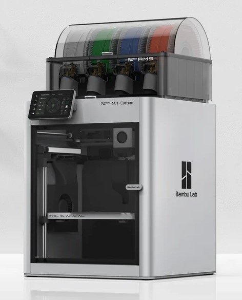

Bambu Lab X1-Carbon

---

# Autres imprimantes FDM

## Imprimantes Delta

* La tête d'impression des imprimantes delta est maintenue par trois bras disposés dans une configuration triangulaire.
* Chaque bras peut être déplacé verticalement afin ainsi d'atteindre n'importe quelles positions.
* Elles permettent d'atteindre des vitesses d'impression élevées mais offrent un volume d'impression plus réduit

  

 

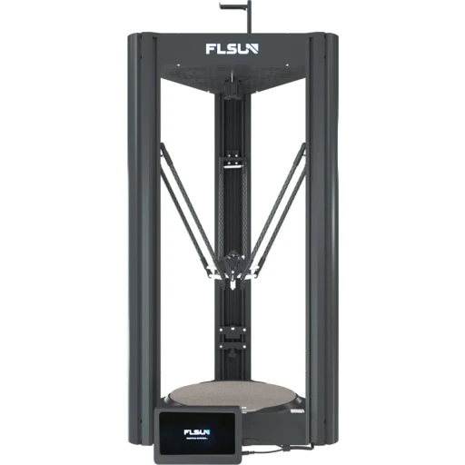

FLSUN V400

---

# Impression multi-matériaux

On rencontre généralement trois approches pour réaliser des impressions multi-matériaux et/ou multicolores :

* Les imprimantes équipées de plusieurs extrudeurs
* Les systèmes de changements de matériaux automatiques
* Découpage et soudage de filament (*e.g.* Mosaic Palette)

  

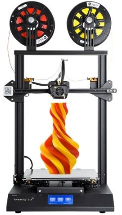

Creality CR-X

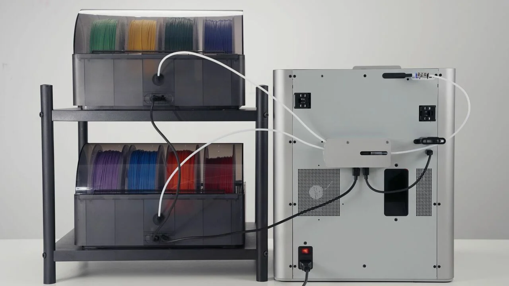

Bambulab AMS  (Automatic Material System)

---

# Les matériaux

## Le PLA

* C'est la star des matériaux, il est facile à imprimer, peu honereux et biodégradable
* Cependant, il n'est pas très résistant à l'humidité et à la chaleur 

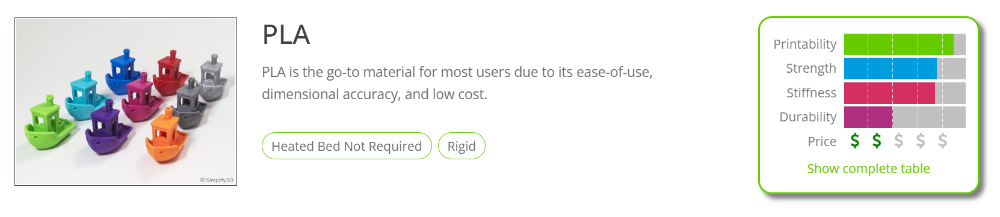

https://www.simplify3d.com/resources/materials-guide

---

# Les matériaux

## L'ABS

* L'ABS a été très populaire avant de se faire voler la vedette par le PLA.
* Il est plus compliqué à imprimer, cependant il offre des propriétés mécaniques et une robustesse face aux conditions climatiques bien meilleures

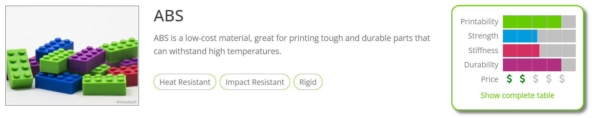

https://www.simplify3d.com/resources/materials-guide

---

# Les matériaux

## Le PETG et l'ASA

* Le PETG et l'ASA offrent tous deux un bon compromit entre le PLA et L'ABS.
* Ils sont plus simples à imprimer que l'ABS tout en offrant de bonnes propriétés mécaniques

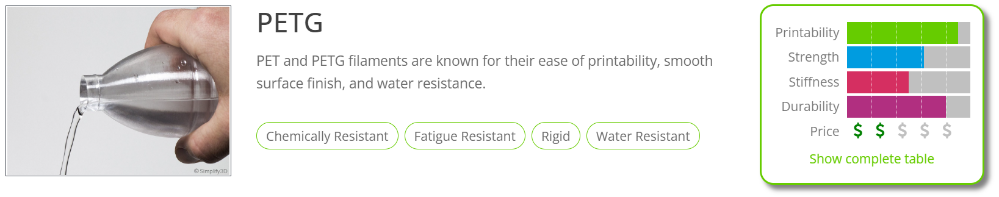

https://www.simplify3d.com/resources/materials-guide

---

# Les matériaux

## Les filaments techniques

* Dans cette catégorie, on retrouve des matériaux aux propriétés mécaniques très intéressantes, mais qui nécessites des imprimantes haute-gamme pour pouvoir être imprimé (température d'impression, filaments abrasifs, *etc*)
* Quelques exemples : filaments renforcés en carbone, nylon, polycarbonate ...

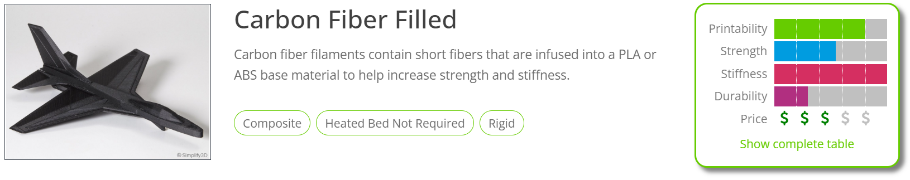

https://www.simplify3d.com/resources/materials-guide

---

# Les matériaux

## Les filaments flexibles

* Il existe une variété de filaments flexibles telle que le TPU qui offrent différentes propriétés d'élasticité.
* Une imprimante *direct drive* est généralement nécessaire pour leur impression

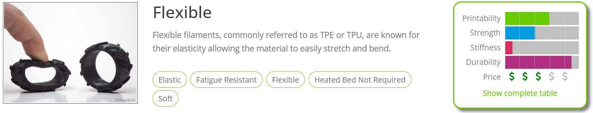

https://www.simplify3d.com/resources/materials-guide

---

# Les matériaux

## Les filaments solubles 

* Les matériaux solubles tels que le PVA sont parfois utilisés comme support pour des impressions dans un autre matériau
* Une imprimante multi-matériaux est nécessaire

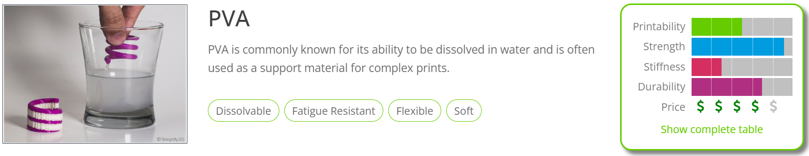

https://www.simplify3d.com/resources/materials-guide

---

# Tableau comparatif des matériaux

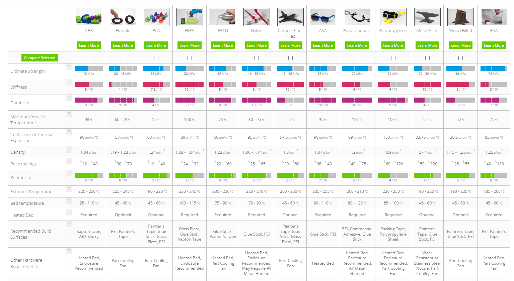

<https://www.simplify3d.com/resources/materials-guide/properties-table/>

<!--
---

# Chaine de production

CAO
Slicer
Impression

---

# Les outils de base

- Pied à coulisse
- Spatule
- Pince à epiler
- Pince coupante

-->