<!-- _class: title -->

# ***CAO pour l'impression 3D***
## Préparation d'une impression 3D
Kévin Hoarau - Septembre 2024

---

<!-- header: CAO pour l'impression 3D -->
<!-- _class: title -->
# ***Entretien de l'imprimante***

---

# Changement du filament

Il existe généralement une option sur l'interface de l'imprimante permettant de lancer une procédure de changement de filament. Cela déclenche généralement la commande G-code `M600`.

Cependant, il est parfois plus simple de faire le changement manuellement, la procédure à suivre est alors :
1. Chauffer la tête d'impression (200° C pour le PLA)
2. Couper le bout du filament à insérer en biais
3. Détendre le mécanisme de serrage de l'extrudeur pour y insérer le filament
4. Insérer le filament jusqu'a que la nouvelle couleur soit bien nette en sortie de buse 

---

# Nivellement du plateau

* Le nivellement du plateau est probablement le critère le plus important pour la réussite d'une impression.
* Il doit toujours être fait à chaud, car le plateau se déforme sous l'effet de la chaleur.
* Pour la majorité des imprimantes le nivellement doit être fait à la main en ajustant des écrous aux quatre coins du plateau.
* L'espace entre le plateau et la tête d'impression doit être de l'épaisseur d'une feuille de papier.

  

 

"3D Printing Essentials: How to Perfectly Level your Bed", MatterHackers

---

# Nettoyage du plateau

* Pour garantir une bonne adhérence des impressions, il est important d'avoir un plateau propre
* En fonction du revêtement, la manière de nettoyer un plateau peut changer
* Généralement, un nettoyage à l'eau savonneuse ou à l'IPA donnent de bons résultats

  

 

filimprimante3d.fr

--- 

# Problème fréquent avec les extrudeurs Bowden

* Il arrive souvent avec les imprimantes de type Bowden que le filament casse entre l'extrudeur et la tête d'impression
* Cela rend alors impossible le changement du filament et détériore les impressions (pas de rétractation)
* Pour résoudre ce problème il faut tout d'abord chauffer la tête d'impression puis dévisser le raccord pneufit afin de récupérer le filament cassé 
* Vous pouvez utiliser un bout de filament pour pousser les morceaux hors du tube PTFE

  

 

---

# Quelques mots sur la sécurité

* Ne pas laisse une imprimante sans surveillance. A minima, on utilisera une caméra IP avec la possibilité d'interrompre l'impression à distance.
* Toujours surveiller la première couche ! Si la première couche n'adhère pas bien alors vous pouvez interrompre de suite l'impression.
* Attention avec la spatule, elle est très coupante. 
* Evidemment ne pas toucher la buse avec les doigts. On utilise une pince à épiler pour retirer les filaments accrochés.

  

 

Ne jamais placer sa main devant la spatule !

---

<!-- _class: title -->
# ***Paramétrage de l'impression dans un Slicer***

---

# Le slicer

* L'utilisation d'un *slicer* est une étape indispensable d'un processus d'impression 3D.
* Ce logiciel a pour rôle de transformer un objet 3D, généralement au format STL, en une suite d'instructions compréhensibles par une imprimante 3D (G-code).
* Une étape intermédiaire est le tranchage de l'objet en plusieurs couches de hauteur fixe, d'où le terme *slicer*.

---

# Un mot sur le G-code

* Le G-code est un langage de programmation très largement utilisé par les machines-outil à commande numérique ou CNC (*computer numerical control*).
* Les imprimantes 3D tout comme de nombreuses graveuses/découpeuses laser ou fraiseuses numériques sont pilotées par des commandes G-code.
* Il est possible de lire et/ou modifier le G-code produit par le slicer à l'aide d'un éditeur de texte.
* Par exemple, vous pouvez manuellement rajouter la commande `M600` à partir d'une certaine couche afin de changer de couleur de filament.

---

# Quel slicer choisir ?

* Il existe un grand choix de slicer, certains sont open-source, d'autres sont propriétaires mais gratuit et certains sont payants.
* La plupart des slicers offrent des fonctionnalités et paramétrages de base similaires
* Votre choix doit donc se faire en fonction de vos critères financiers, ergonomique, fonctionnalités avancées, *etc*
* Dans ce cours, j'utiliserai UltiMaker Cura qui est open source.

---

# Comment paramétrer son impression 3D ?

* Il existe un grand nombre de paramètres qui peuvent être ajustés en fonction de la pièce à imprimer.
* Les slicers modernes proposent pour la plupart des paramètres de bases pour bon nombre de modèles d'imprimantes.
* On recommande généralement, de partir des paramètres de bases proposés par le slicer et d'ajuster certains entre-eux en fonction de l'impression à produire ou du résultat obtenu sur l'impression.

  

 

Extrait des parèmetres d'impression dans Cura

---

<!-- _class: title -->
# ***Paramètres importants***

---

# Températures

* Ces paramètres sont à définir en fonction du matériau utilisé
* Par exemple, pour le PLA la température de la tête d'impression devrait être configuré autour de 200°C et celui du plateau aux alentours de 60°C.
* On peut légèrement augmenter la température de la tête en cas de sous extrusion ou la baisser si on observe beaucoup de *stringing*

  

 

Exemple de stringing simplify3d.com

---

# Hauteur de couche

* Ce paramètre défini la hauteur des couches générées par le slicer.
* La valeur par défaut est généralement 0.2mm.
* On peut baisser cette valeur si la pièce comporte des détails très fins ou l'augmenter pour réduire le temps d'impression.
* Elle doit être choisie de manière à être proportionnel aux nombres de pas du moteur. Par exemple, pour une imprimante Creality : `0.12,0.16,0.20,0.24,0.28`

  

Calculateur Prusa Research

---

# Remplissage

Pour économiser du plastique, on laisse souvent beaucoup de vide dans le remplissage d'une impression.

Deux paramètres sont à considérer :
* Le motif de remplissage défini la forme du remplissage. On optera généralement pour un motif tri-dimensionnel (cubique, gyroïde, *etc*) pour ces meilleurs propriétés mécaniques

* Le pourcentage de remplissage est généralement choisi entre 10% et 20%. Cependant, il peut être augmenté pour obtenir une pièce plus solide.

  

Cubique à 20%

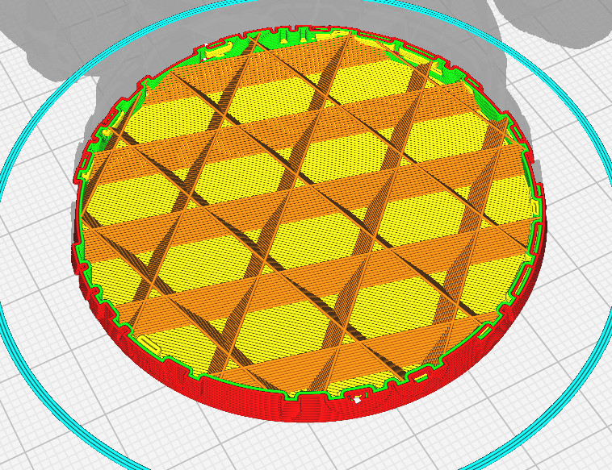

Cubique à 10%

---

# Epaisseur de la coque

Il peut être utile d'épaissir la coque de la pièce afin de la rendre plus solide sans augmenter le remplissage.

Pour cela, les paramètres à modifier sont :
* Le nombre de parois
* Le nombre de couches supérieures et inférieures 

  

2 parois

4 parois

---

# Adhésion au plateau

Pour certaines pièces ou certains matériaux, il peut être utile d'augmenter la surface de contact avec le plateau.

Deux paramètres peuvent être utilisés :
* L'utilisation d'une bordure permet ajouter une surface d'adhérence autour de la pièce.
* Le radeau imprime plusieurs couches d'interface avant d'imprimer la pièce au-dessus de ces couches.

  

Piece d'origine

Bordure

Radeau

---

# Comment améliorer la qualité des impressions ?

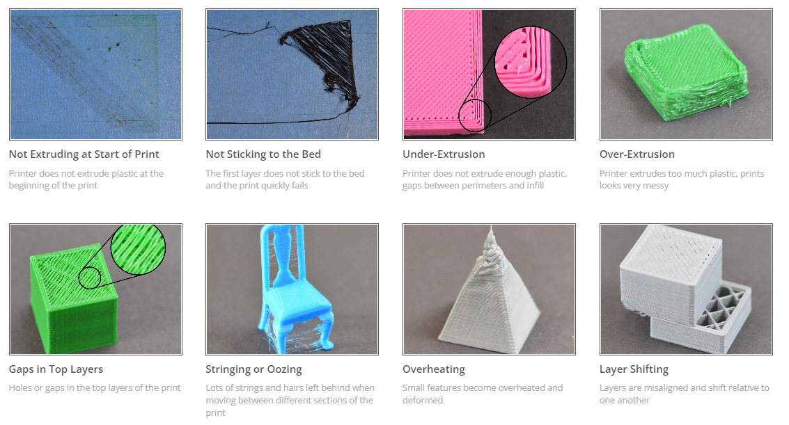

<https://www.simplify3d.com/resources/print-quality-troubleshooting/>

---

<!-- _class: title -->
# ***Les supports***

---
 
# Pourquoi mettre des supports

 

* Il n'est pas possible d'imprimer dans le vide.
* Pour éviter cela, il faut ajouter des supports.
* Tout les slicers permettent de le faire.
* Ils peuvent être générés automatiquement par le slicer.
* Certains slicers permettent également de placer les supports à la main.

  

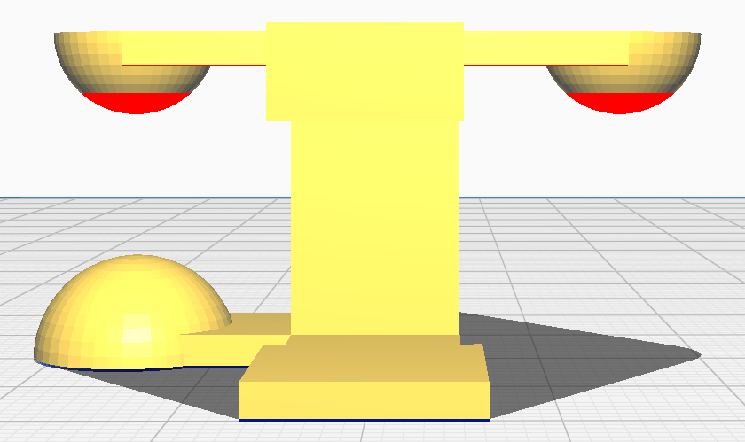

Les parties en rouges nécesite des supports

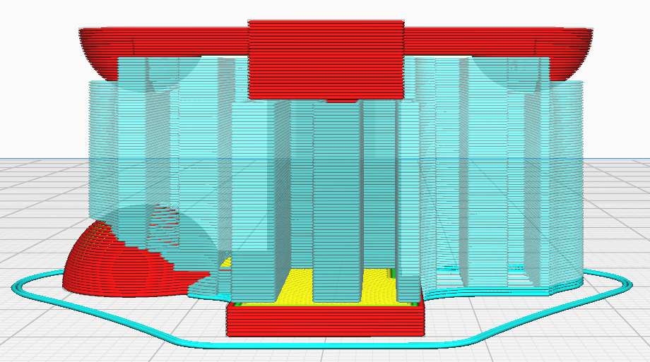

Exemple avec support

---

# Paramètres de supports

Quelques paramètres pour les supports :
* Type de support : normal ou arborescent
* Motif de support
* Angle à partir duquel un support est nécessaire

 

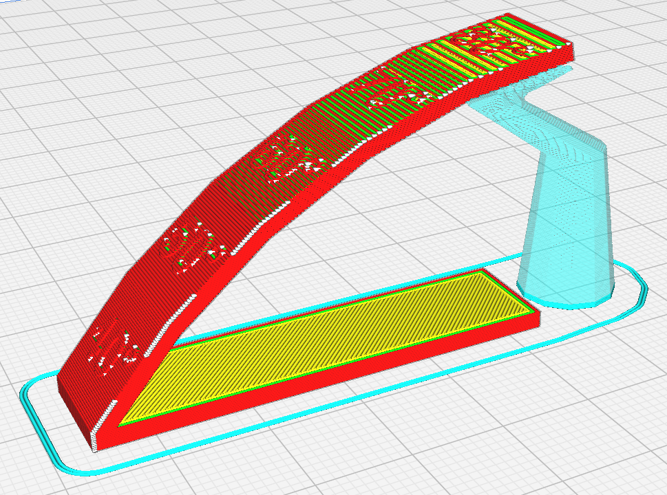

Support arborescent

  

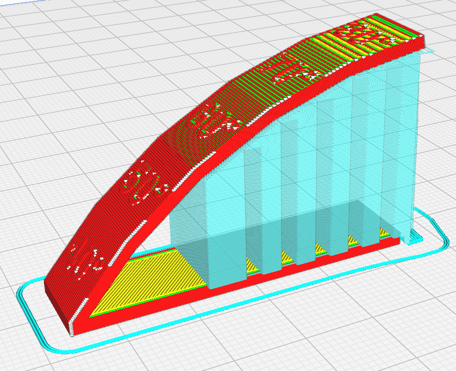

Angle à 60°

Angle à 80°

---

# Comment éviter les supports

* Orienter la pièce différemment.
* En connaissant l'angle maximum qu'il est possible d'imprimer avec son imprimante. Il existe des fichiers 3d pour mesurer cela.
* En utilisant le pontage (bridging). Là aussi des fichiers 3d existent pour identifier la distance maximum qui peut être ponté.

  

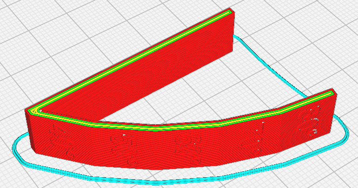

Meilleure orientation

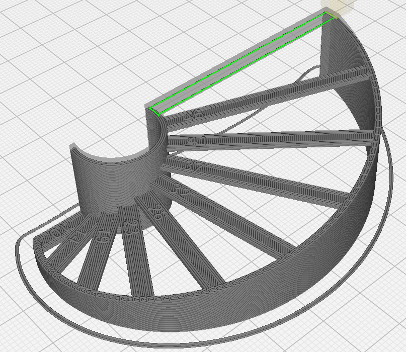

Exemple de pontage

---

# Placement manuel

* Généralement les slicers ont tendance à générer plus de support que nécessaire
* La plupart permettent de placer des supports manuellement

 

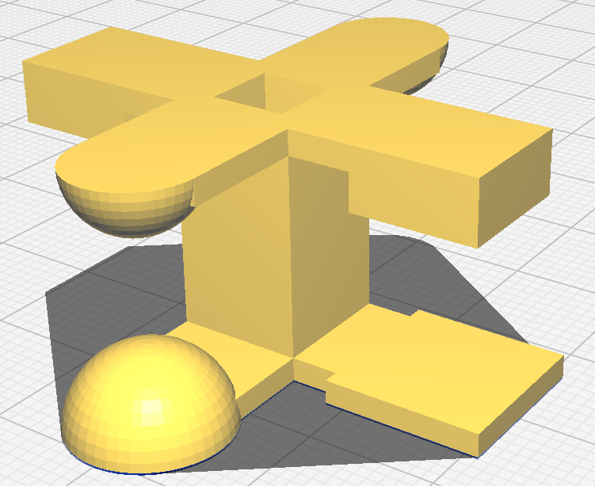

Pièce nécessitant des supports

  

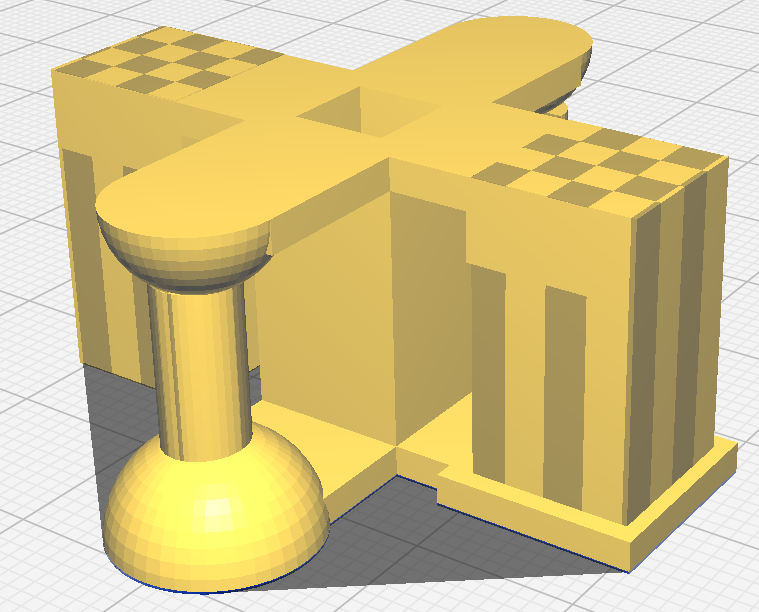

Placement manuel

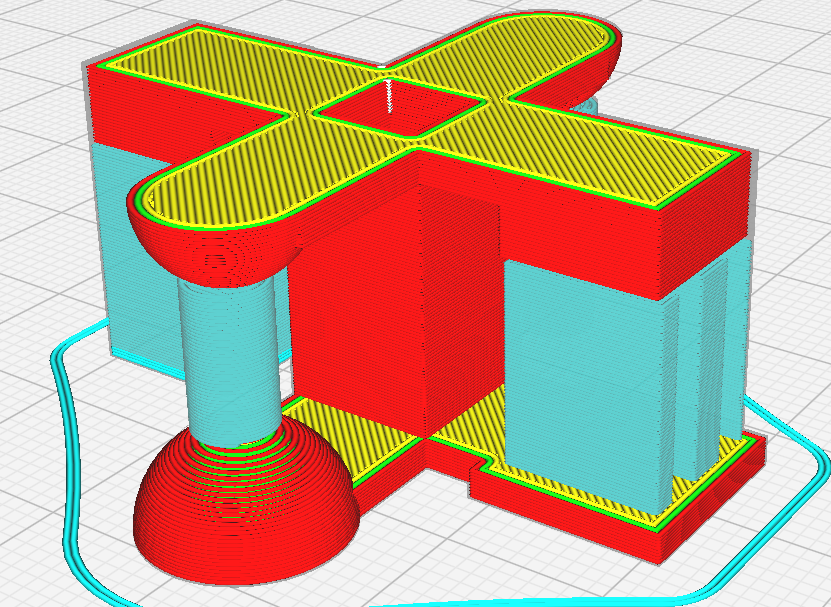

Après slicing

---

# Comment orienter la pièce

* Evidemment on essaye d'éviter les supports.
* Il faut prendre en compte les contraintes mécaniques (décollement des couches).
* On maximise la surface de contact avec le plateau.

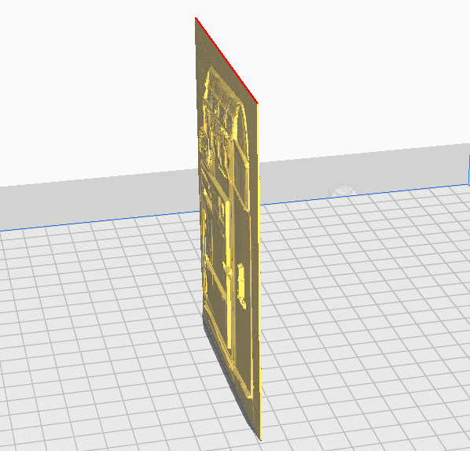

Placement manuel

  

Mauvaise resistance mécanique

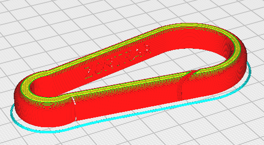

Bonne resistance mécanique

---

# Comment réduire les temps d'impression ?

* Augmenter la hauteur de couche
* Réduire le pourcentage de remplissage
* Réduire le nombre périmètres et augmenter la vitesse des périmètres internes
* Augmenter (raisonnablement) la vitesse d'impression

---

# Comment décoller l'impression

* Laisser refroidir le plateau.
* Si l'impression ne se décolle pas facilement, on peut utiliser la spatule.

 

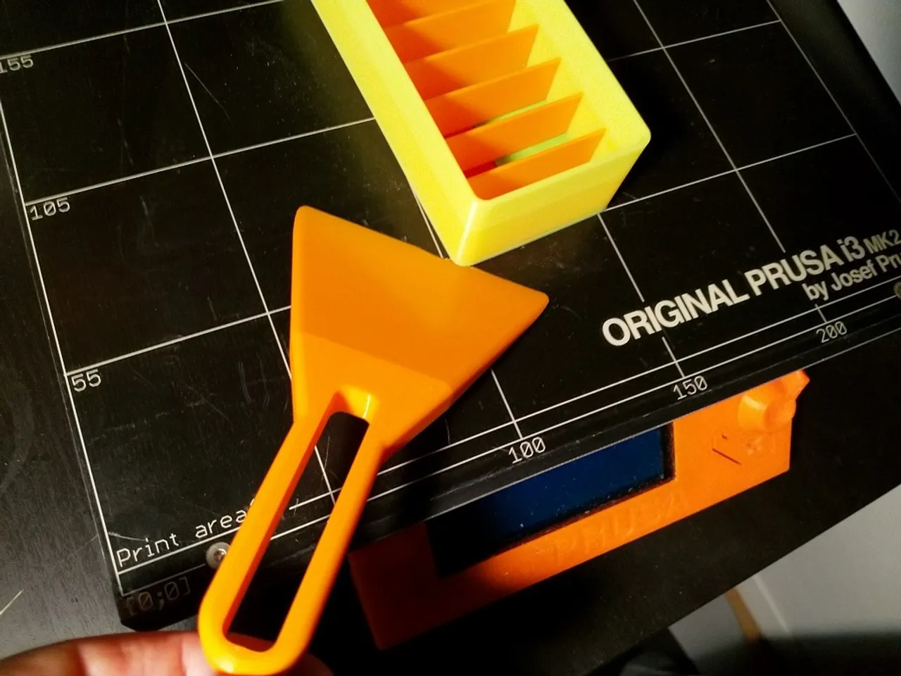

Utilisation de la spatule

<!--

---

# Post-processing

Poncage
Epoxy
Pistolet à air chaud
Ebavureur

---

# Comment faire adherer les pieces au plateau

---

# Ajouter une pause / Changer de filament en cours d'impression

---

Bed leveling
Manuel vs assisté

-->

--- 

# Comment lancer l'impression

* En exportant le fichier `.gcode`, puis en lancant l'impression depuis une carte SD
* Via USB : la plupart des slicers permettent de se connecter en USB à l'imprimante afin de lancer l'impression.
* Via une interface web : certaines imprimantes sont équipées d'interfaces web. Sinon, on peut installer Octoprint (généralement sur un raspberry). En connectant l'imprimante à Octoprint on peut alors gérer l'imprimante et lancer des impressions via une interface web.

  

 

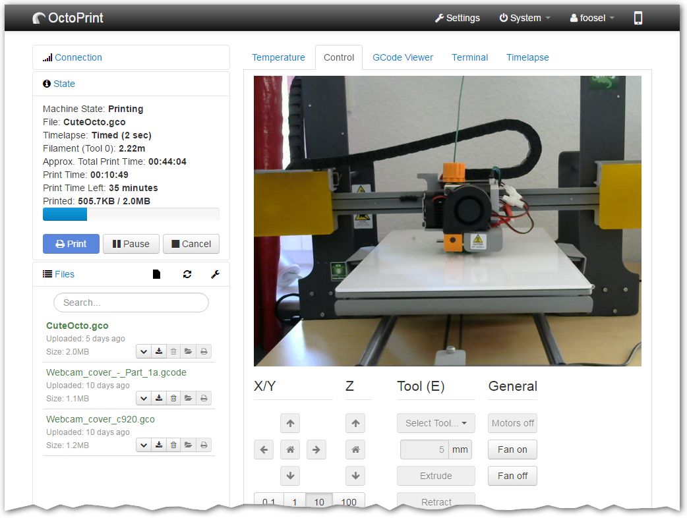

Interface web d'Octoprint

--- 

# Bonus : 3 plugins Cura à avoir

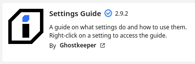

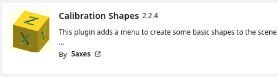

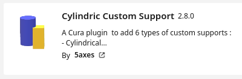