<!-- _class: title -->
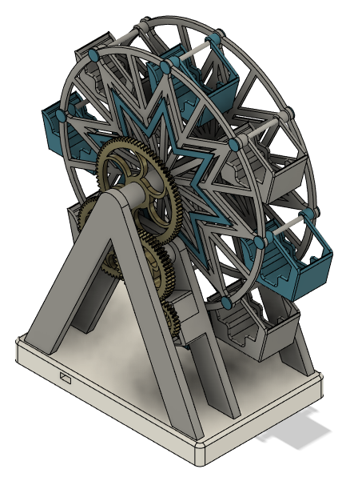
# ***CAO pour l'impression 3D***
## Modélisation 3D
Kévin Hoarau - Septembre 2023

---
<!-- header: CAO pour l'impression 3D -->
<!-- _class: title -->
# ***Conception assistée par ordinateur (CAO)***

---

# Conception assistée par ordinateur (CAO)

* Les logiciels de conception assistée par ordinateur (CAO) ou *computer aided design* (CAD) permettent d'effectuer des modélisations géométriques afin de concevoir des produits.
* Certains logiciels de CAO permettent également de tester le produit virtuellement à l'aide de simulations numériques.
* Le terme de modélisation 3D est souvent utilisé pour désigner la pratique de la CAO 3D.

  

 

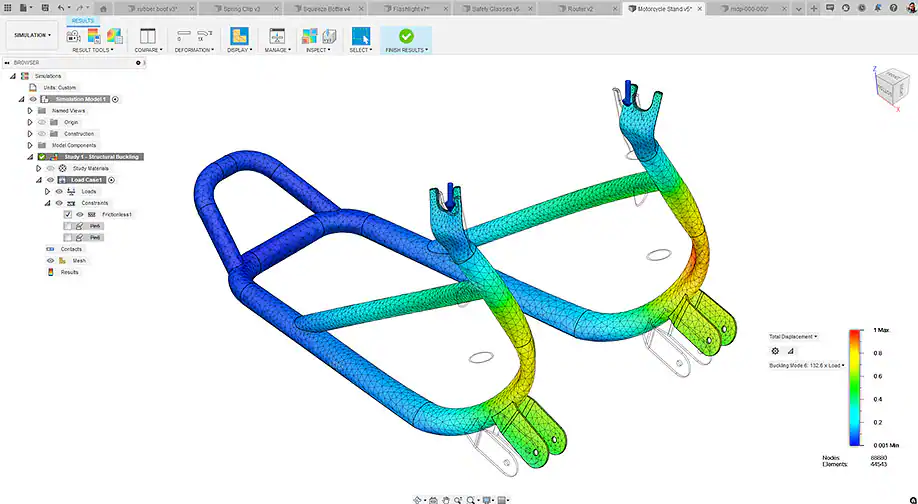

Exemple de simulation dans Fusion 360

---

# Catégories de logiciels de CAO 3D

* **Facilité de prise en main :** Tinkercad, Sketchup, ...

* **Conception paramétrique :** Solidworks, Fusion 360, FreeCAD, Onshape, ...

* **Langage de programmation :** OpenSCAD

* **Logiciel d'infographie 3D :** Blender, Maya, ZBrush, ...

  

 

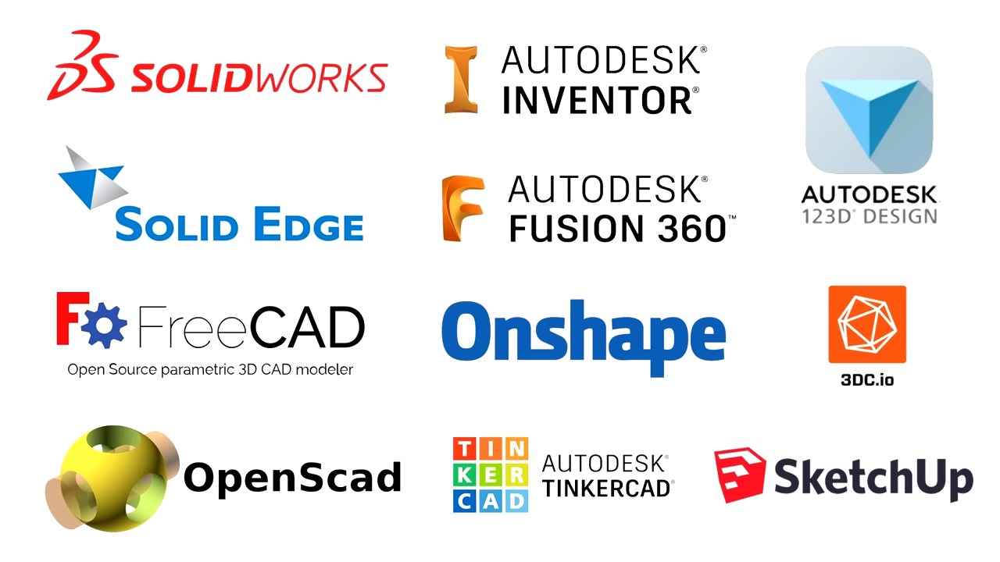

Exemples de logiciels de CAO 3D

("Selecting a free 3D CAD option", Teaching Tech)

---

# Dans ce cours

* Nous utiliserons des logiciels de conception paramétrique.
* Je recommande l'utilisation d'Onshape pour son fonctionnement dans le cloud (malgrès une politique tarifaire discutable).
* Fusion 360 est également une bonne alternative, mais nécessite une installation.
* Pour les amoureux de l'open-source et les plus aventureux, FreeCAD sera votre compagnon idéal. 

---

<!-- _class: title -->
# ***Introduction à la conception paramétrique***

---

# Esquisse

* Le point de départ de toutes modélisations 3D est généralement la création d'une d'esquisse ou *sketch*
* Elle permet de dessiner des formes en 2D qui seront ensuite utilisées pour construire des solides en 3D.
* En combinant des formes et des contraintes géométriques il est possible de construire des formes complexes.

  

 

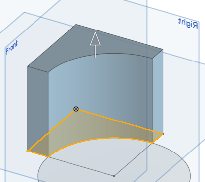

Exemple de construction d'un solide à partir d'une esquisse

---

# Création d'une esquisse

* Une esquisse doit être créée à partir d'un plan.
* Si le projet ne contient aucun solide alors on prendra un plan parmi $(x,y)$, $(x,z)$ ou $(y,z)$.
* Il est également possible d'utiliser une face d'un solide comme plan pour la construction de l'esquisse.

  

 

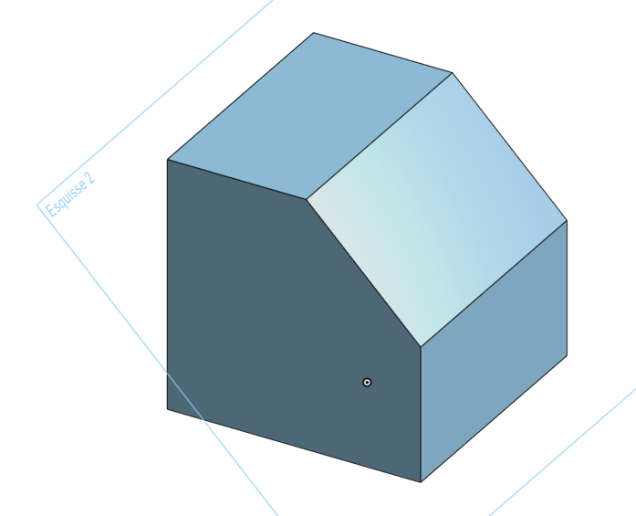

Exemple de construction d'une esquisse à partir d'une face

---

# Les outils de base de l'esquisse

* **Formes :** de nombreuses formes sont disponibles : lignes, rectangles, cercles, arcs, polygones, *etc*.
* **Mode construction :** le mode construction permet de dessiner une forme qui sera utilisée pour construire d'autres formes sans quelle soit prise en compte lors de la création du solide.
* **Contraintes :** des contraintes géométriques peuvent être définies sur les formes : côte, égal, parallèle, tangente, *etc*.

  

 

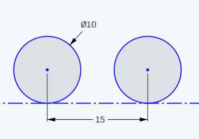

Deux cercle et une ligne de construction (contraintes appliquées : côtes, égal et tangente)

---

# Les outils de répétitions

Les outils de répétitions permettent de créer une ou plusieurs formes à partir d'une forme existante.

Le **décalage** permet de reproduire une forme de manière concentrique :

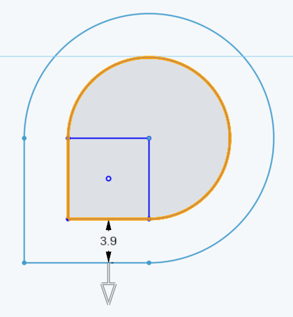

---

# Les outils de répétitions

Les outils de répétitions permettent de créer une ou plusieurs formes à partir d'une forme existante.

Le **miroir** permet d'appliquer une symétrie axiale :

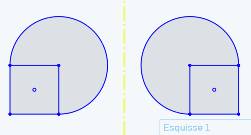

---

# Les outils de répétitions

Les outils de répétitions permettent de créer une ou plusieurs formes à partir d'une forme existante.

La **répétition linéaire** permet de reproduire une forme sur une grille :

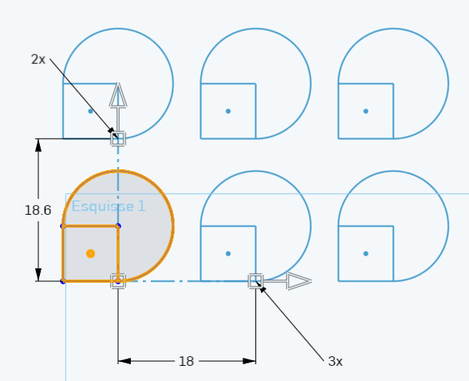

---

# Les outils de répétitions

Les outils de répétitions permettent de créer une ou plusieurs formes à partir d'une forme existante.

La **répétition circulaire** permet de reproduire une forme sur un cercle :

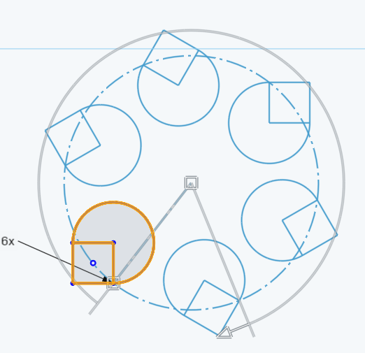

---

# Les variables

* L'utilisation de variables est une bonne pratique permettant de modifier rapidement une modélisation.
* Lorsque la variable est modifié les changements sont appliqués en cascades aux esquisses et aux solides construits à partir des esquisses.

  

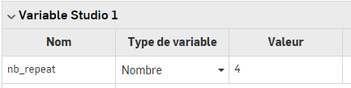

Déclaration d'une variable

 

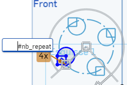

Utilisation d'une variable

---

# Création d'un solide

## Extrusion

* L'opération la plus courante pour créer un solide à partir d'une esquisse est l'extrusion.

* Si le nouveau solide entre en contact avec un solide existant alors il est possible d'effectuer des opérations booléennes : union, intersection, différence (*e.g.* perçage).

  

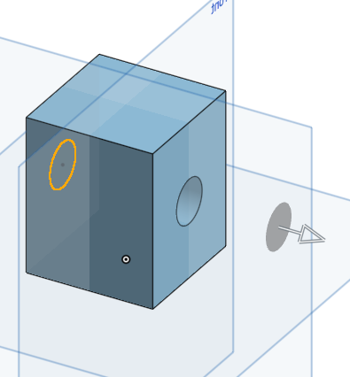

Exemple de percage à l'aide d'une extrusion

---

# Création d'un solide

## Révolution

* Un autre opération très utile est la révolution.
* Elle permet d'extruder une esquisse en effectuant une rotation autours d'un axe.

  

  

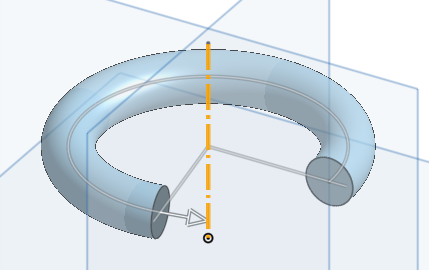

Exemple revolution

---

# Création d'un solide

## Balayage

* Le balayage permet d'effectuer une extrusion en suivant une courbe. 
* La courbe utilisée peut prendre est libre et peut prendre n'importe qu'elle forme
* Cette opération est souvent utilisée pour créer des pas de vis.

  

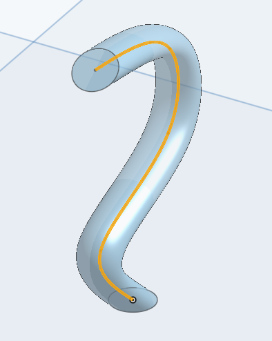

Exemple de balayage

---

# Opérations sur les solides

## Opérations booléennes

* Les opérations booléennes s'appliques sur deux solides qui sont en contact
* Les opérations possible sont : l'union, l'intersection et la différence.

  

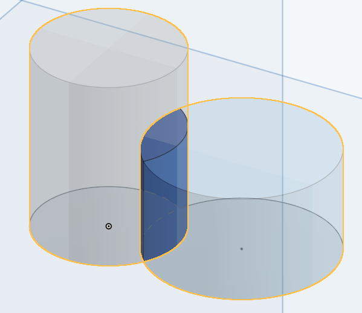

Exemple d'intersection entre deux cylindres

---

# Opérations sur les solides

## Congés et chanfreins

* Les congés et chanfreins permettent de rendre les arêtes d'un solide moins abrupt.
* Un congé permet d'obtenir une arête arrondie.
* Un chanfrein permet d'obtenir une arête inclinée.

  

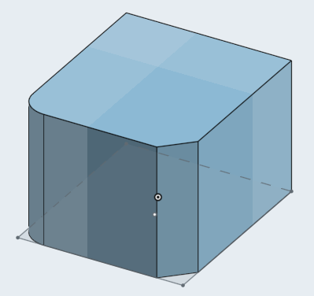

Exemple de congé (à gauche) et de chanfrein (à droite) de 5mm

---

# Opérations sur les solides

## Opérations de répétitions

* Comme pour les esquisses, il existe des opérations de répétitions
* L'opération miroir applique une symétrie à l'aide d'un plan de symétrie
* Les opérations de répétitions linéaires et circulaires permettent de reproduire un solide sur une grille ou un cercle.

  

 

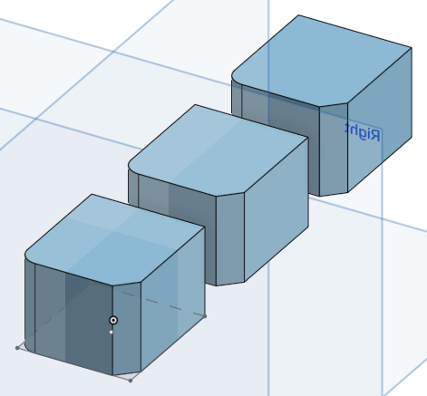

Exemple de répétition linéaire

---

<!-- _class: title -->
# ***Bonnes pratiques de modélisation***
# ***pour l'impression 3D***

---

# Eviter les supports

* Dès la phase de conception, il faut penser à l'orientation que va avoir votre pièce durant d'impression.
* Il faut alors éviter de créer des angles trop importants.

 

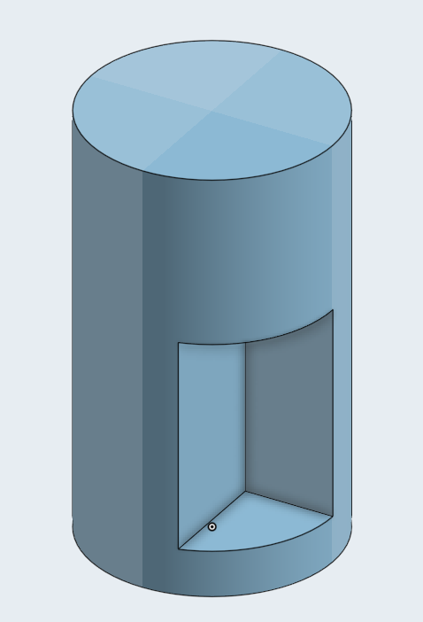

Pièce nécessitant des supports

  

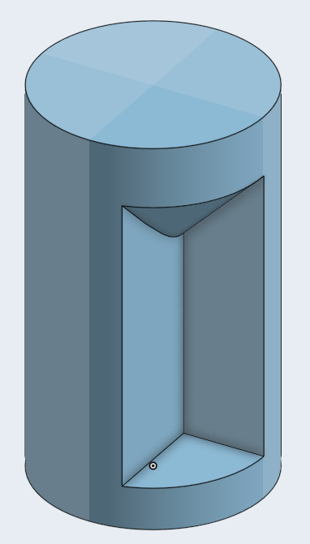

Ajout d'un chanfrein

---

# Penser aux tolérances

* L'impression 3D est un processus de fabrication imparfait.
* Si deux pièces doivent s'imbriquer, il faut penser à laisser des tolérances suffissantes.
* Généralement un espace de 0.5mm est suffisant.
* On peut également laisser un espace plus grand, mais cela créera du jeu.

  

 

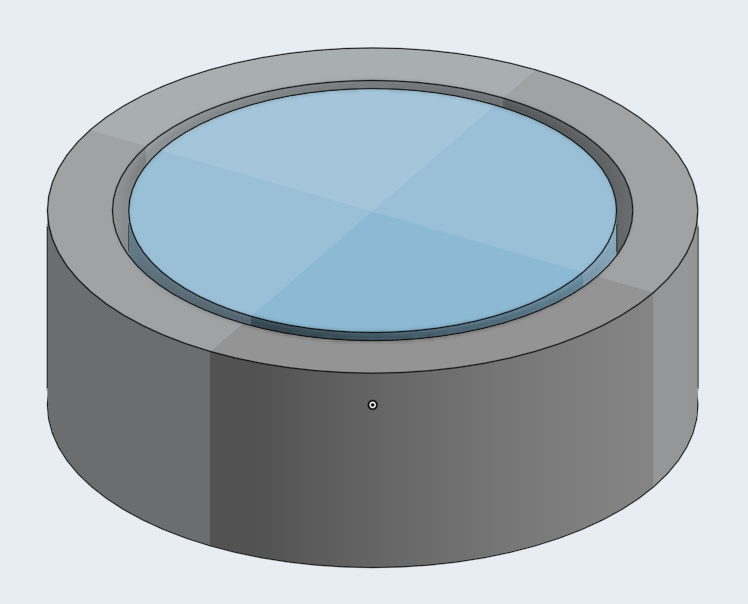

Deux solides espacés de 0.5mm.

---

# Autres considérations

* Prendre en compte volume d'impression de l'imprimante.
- Ne pas créer de parois ou des détails trop fins. L'imprimante à une buse de 0.4mm et une hauteur de couche minimum de 0.1mm.
- La pièce doit avoir une surface plane, sinon il faudra des supports.

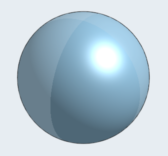

Pièce sans surface plane

  

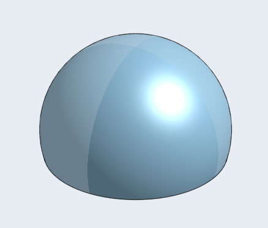

Pièce avec une surface plane

---

# Vérifier sa modélisation

Deux outils pratiques :
* L'outil de mesure permet de vérifier les côtes.
* Le plan de coupe permet de visualiser une section de la pièce.

  

 

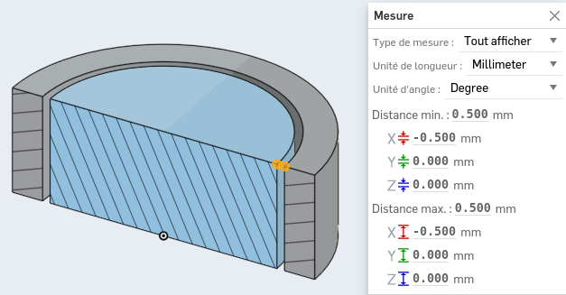

Plan de coupe et outil de mesure

---

<!-- _class: title -->
# ***Un peu de pratique***

---

# Exercice 1 : la boite

Nous allons créer une boite paramétrique.

Les variables suivantes pourront être ajustées pour modifier la boite :
* hauteur, longueur et largeur
* épaisseur des murs
* tailles des congés.

  

 

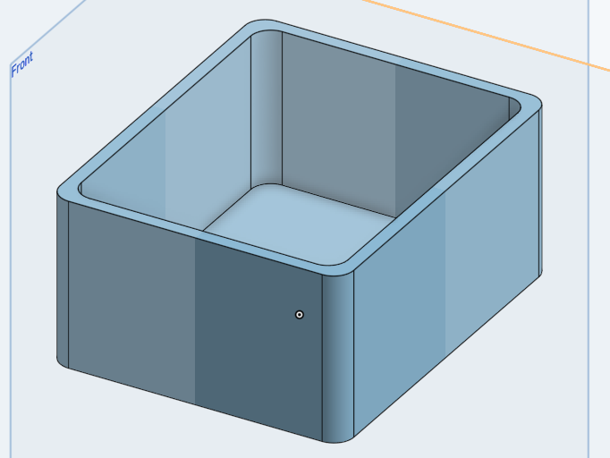

Résultat attendu

---

# Exercice 2 : le couvercle

Nous allons maintenant créer un couvercle.

Les variables suivantes pourront être ajustées :
* hauteur, longueur et largeur
* tolérance pour le montage du couvercle sur la boite
* tailles des congés,
* le diamètre des trous

  

 

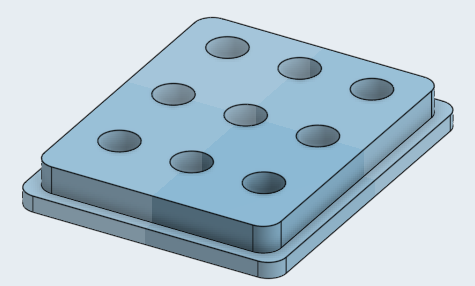

Résultat attendu

---

# Exercice 3 : le verre

Utilisez l'outil de révolution pour créer un verre à pied.

 

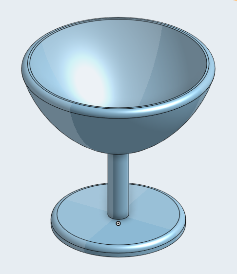

Exemple de résultat

